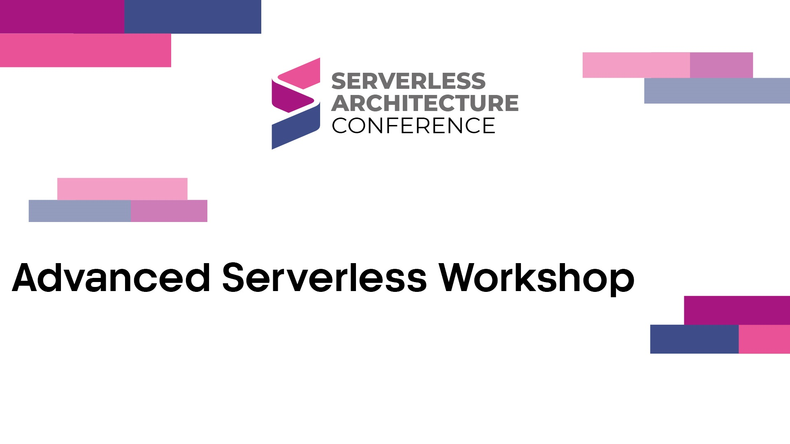

## Description
Immerse yourself in a full-day workshop delving into advanced serverless architectures across Google Cloud Platform (GCP), Amazon Web Services (AWS), and Microsoft Azure. Led by expert practitioners, this session covers practical implementations, best practices, and platform-specific solutions for real-world business problems.

**Agenda:**

1. Learn serverless architecture fundamentals and cloud and software design patterns.
2. Understand a complex business problem suited for serverless computing.
3. Dive into GCP's serverless solutions with a detailed demonstration.
4. Explore AWS's serverless capabilities with live implementations.
5. Discover Azure's serverless ecosystem through comprehensive demonstrations.
6. Learn how to build a serverless application using AWS services like API Gateway, Lambda, DynamoDB, and SQS
7. Explore Amazon DevOps Guru's capabilities to detect operational issues
8. Discover how to integrate Amazon DevOps Guru with PagerDuty
9. Engage in an interactive discussion panel with expert presenters.

**Key Takeaways:**

- Gain a thorough understanding of serverless architectures.
- Explore practical implementations across GCP, AWS, and Azure.
- Deepen your knowledge of platform-specific offerings and best practices
- Explore how DevOps Guru’s Proactive Insights help identify configuration anti-patterns and optimize AWS resource management.
- Deepen your knowledge of incident management by integrating DevOps Guru with PagerDuty for improved response and handling.
- Engage with industry experts to enrich your serverless journey.

**Don't Miss Out:**

Expand your expertise and stay ahead in serverless innovation by joining us for a day of learning, exploration, and collaboration in advanced serverless computing.

| Vadym Kazulkin                                               | Martin Dowden                                                | Chad Green                                                   |
| ------------------------------------------------------------ | ------------------------------------------------------------ | ------------------------------------------------------------ |
|  |  |  |

## Materials and Demos

- Available Later

## Time and Location

[Serverless Architecture Conference - Berlin 2024]([Serverless Architecture Conference 2024 | Berlin or Online (serverless-architecture.io)](https://serverless-architecture.io/berlin/))  
Berlin, Germany  
October 21, 2024
09:00 to 17:00

## Other Presentations
- [Berlin 2022](..\Berlin-2022\README.md) 
- [London 2023](..\London-2023\README.md)
- [London 2024](..\London-2024\README.md) 

