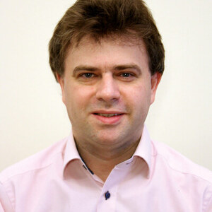

# Martine Dowden

**Father of 3 | Head Of Development at ip.labs | Public Speaker | AWS Community Builder | @VKazulkin on Twitter | Blogger on dev.to/vkazulkin**

Cologne, Boon, Germany*  

 

Vadym Kazulkin is Head of Development at ip.labs GmbH, a 100% subsidiary of the FUJIFILM Group, based in Bonn. Vadym has been involved with the Java ecosystem for over twenty years. His focus and interests currently include the design and implementation of highly scalable and available applications, Serverless and AWS Cloud. Vadym is the co-organizer of the Java User Group Bonn meetup and AWS Community Builder in the Serverless category and a frequent speaker at various Meetups and conferences.