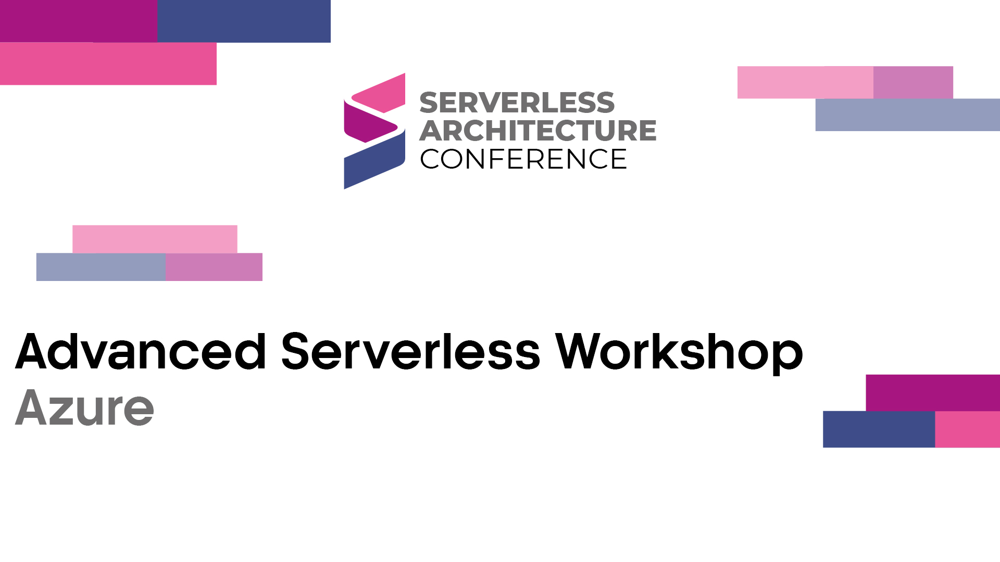

## Description
Have you been doing serverless for a while but don’t feel you’re getting the most out of it? This interactive workshop will allow you to interact with experienced serverless professionals and gain three different perspectives on leveling up your serverless architecture.

* Learn new approaches and design patterns.
* Hear stories from the trenches about what worked (and what did not)
* Gain perspective on cost, performance, scalability, and resilience.
* Includes examples covering AWS Lambda, Azure Function, and Google Functions  

This four-part workshop is designed for experienced serverless developers and architects who want to deepen their knowledge, learn exciting new aspects of serverless technology, and network with other serverless experts. Some perspectives on the major platforms will be provided, but this workshop is intended for all practitioners, regardless of their current technology stack.

| Bryan Hogan | Michael Dowden | Chad Green |
| ------------- | -------------- | ---------- |
|  |  |  |

## Materials and Demos

- [Presentation](EventMaterials/AdvancedServerlessWorkshop_Azure_London2023.pdf)
- [Portfolio Management Demo](Demos/Portfolio%20Management)
- [Drone Telemetry Demo](Demos/Drone%20Telemetry)

## Time and Location

[Serverless Architecture Conference - London 2023](https://serverless-architecture.io/serverless-architecture-design/advanced-serverless-workshop/)  
London, UK  
April 27, 2023  
8:45 AM BST  
Edwards 7  

## Other Presentations
- [Berlin 2022](..\Berlin-2022\README.md) 
- [London 2024](..\London-2024\README.md) 